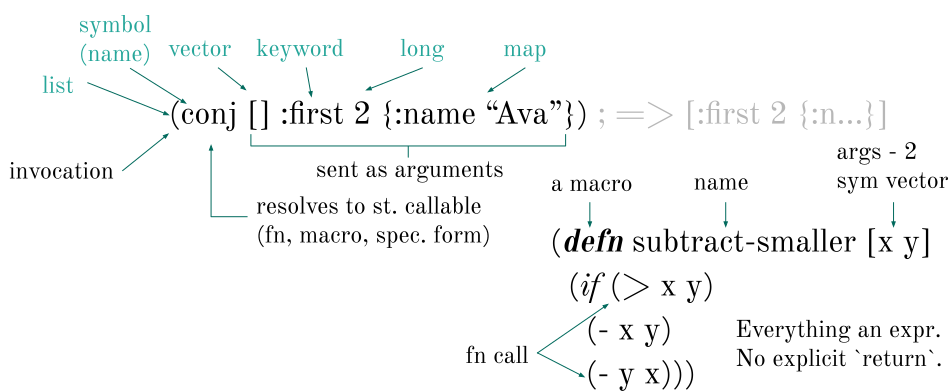

# TMP: Wolframite Clojure Primer, as markdown

A very brief introduction to Clojure for users of Wolframite not yet familiar with the language.

## Elementary syntax

Syntax of a programming language defines how text is turned into data. Fortunately, Clojure syntax is very simple and consistent:


Clojure is a Lisp, i.e. the code consists of the same data you use as a programmer. (Primarily, symbols, lists, and vectors.)

_Vectors_ (`[ ... ]`) are similar to Java(Script) arrays. 

_Keywords_ (`:whatever`) are like a special kind of strings, used primarily as keys in maps. (Plus, they can also be used as functions taking a map and returning the value stored there at that key.)

_Maps_ are heterogeneous pairs of arbitrary keys and values: `{:key 1, "another" 2, 42 ["arbitrary" "keys/values"]}`. Here, we have three keys (`:key`,`"another"`,`42`) and their values (`1`,`2`, `[ ... ]`).

This is the syntax, i.e. how characters become data. Now, on to _semantics_, i.e. what does the data mean:


A list is _interpreted_ as an invocation (e.g. a function call). The first element is typically a symbol naming something invocable - a function, a macro, or a special form. (We don't really need to distinguish between the three here.) This is an elementary pattern of Clojure code:



Here we have a piece of code which defines a new function (`defn`) named `subtract-smaller`, taking two arguments, and subtracting the smaller one from the larger one. We can see that defining a function looks just the same as invoking one. Highlights:

`>`, `-` are function calls - there are no operators in Clojure. 

`if` is a "special form", i.e. just like a function call for our purposes.

There is no `else`, contrary to Java(Script), the (optional) third argument to `if` is the else-branch of code. Notice that there are no "reserved words" as in other languages - everything is just a function or friends. Also notice that everything in Clojure returns a value, including the `if` (namely, the value of the executed branch). Finally, there is no explicit `return` - the output of the last expression in a function body is the return value.

## Key building blocks of a Clojure program

The [Clojure Cheatsheet](http://jafingerhut.github.io/cheatsheet/clojuredocs/cheatsheet-tiptip-cdocs-summary.html) provides a great, well-organized overview of most things Clojure offers. Let's list some of the most important ones here:

**TODO**

* Definitions:
  * [def](https://clojuredocs.org/clojure_core/clojure.spec.alpha/def) - define a global constant 
  * [fn](https://clojuredocs.org/clojure_core/clojure.core/fn) - make an anonymous function, also known as "lambda" (there is also the shorthand form `#(my-cool-fn %)`) 
  * [defn](https://clojuredocs.org/clojure_core/clojure.core/defn) - define a named function
  * [ns](https://clojuredocs.org/clojure_core/clojure.core/ns) - at the start of a file to declare a new namespace, and `:require` (import) other namespaces
* "Control":
  * [let](https://clojuredocs.org/clojure_core/clojure.core/let) - define _local_ constants 
  * [if](https://clojuredocs.org/clojure_core/clojure.core/if), [when](https://clojuredocs.org/clojure_core/clojure.core/when), ...
* Arithmetics: [+](https://clojuredocs.org/clojure_core/clojure.core/%2B), -, *, etc.
* [Data structures and literals](https://clojure.org/reference/data_structures): `[]` for vectors, `{:k "val"}` for maps, `nil` for nil/null/no data, ...
* Sequence processing: 
  * [map](https://clojuredocs.org/clojure_core/clojure.core/map) - "update" each element with a function
  * [filter](https://clojuredocs.org/clojure_core/clojure.core/filter) - remove elements not passing a test
  * [reduce](https://clojuredocs.org/clojure_core/clojure.core/reduce) - process each element, building an output value iteratively
  * [apply](https://clojuredocs.org/clojure_core/clojure.core/apply) - apply a function expecting individual arguments to a sequence of their values; ex.: `(apply + [1 2]) ; => 3`
  * ...
* Extracting parts of a sequence:
  * [first](https://clojuredocs.org/clojure_core/clojure.core/first), [second](https://clojuredocs.org/clojure_core/clojure.core/second), [take](https://clojuredocs.org/clojure_core/clojure.core/take), [last](https://clojuredocs.org/clojure_core/clojure.core/last), ...
* "Changing" data - mutating operations return new data, without changing the original
  * [conj](https://clojuredocs.org/clojure_core/clojure.core/conj), [assoc](https://clojuredocs.org/clojure_core/clojure.core/assoc), [dissoc](https://clojuredocs.org/clojure_core/clojure.core/dissoc) - add an element to a sequence, add/remove to/from a map
* Truth: everything but `nil` and `false` is "truthy" and considered as `true`, f.ex. in `if`
* Comments and whitespace: `;` is a line comment, and `,` is treated just as a space and can be used to improve readability
* Mutable data holders: `atom` - when you need to keep global state safely accessed from multiple threads

You will likely also want to [interoperate with Java](https://clojure.org/reference/java_interop) libraries and code, which Clojure is good at.

## Data, code, and evaluation

For Wolframite, you need to understand a little bit about the transformation from text ➡︎ data ➡︎ code ➡︎ behavior.

Text is ingested by the [Clojure Reader](https://clojure.org/reference/reader) at read time according to the rules of _syntax_ discussed above, to become _data_. At run time, this data is then _interpreted_ according to the rules of _semantics_ as _code_ and _evaluated_ accordingly, to become behavior. (There is also compile time between the two, when data becomes code, but we can safely ignore that for our purposes.)

These distinctions matter to us, because we are trying to do something unusual - namely turn text into data that we translate ourselves into Wolfram expressions and send to Wolfram for evaluation. (And, on the way back, we turn Wolfram responses back into Clojure data.)

Contrary to normal Clojure execution, we do not want Clojure to interpret data as code and try to evaluate it. We want our data as data, and we interpret and evaluate them ourselves.

Let's compare the result of evaluating Clojure code vs. Wolframite code, to make this distinction clearer. In Clojure we can do:

```clj
(+ (* 3 (math/pow 2 2)))
```

and we get back a number - the result of running the code. If we write analogous code in Wolframite:

```clj
(w/+ (w/* 3 (w/Power 2 2)))
```

we get back data representing this very expression. We could also write it directly as data:

```clj
(quote (+ (* 3 (Power 2 2))))
```

Or, leveraging a [hint to the Reader](https://clojure.org/reference/reader#_quote), in a shorter way:

```clj
'(+ (* 3 (Power 2 2)))
;; the Reader turns ' into (quote ...)
```

Here, both [`quote`](https://clojuredocs.org/clojure.core/quote) and `'` tell Clojure to skip interpreting and evaluating the data.

We interpret and evaluate this data ourselves, via `wl/eval`:

```clj
(wl/eval (w/+ (w/* 3 (w/Power 2 2))))

(wl/eval '(+ (* 3 (Power 2 2))))
```

The quoted form is the _raw Wolframite form_, while the the `w/...` form is the _evaluated Wolframite form_. The evaluated form is more convenient, because it supports code-completion, syntax checking, and other conveniences, such as combining expressions with Clojure threading macros (see below). However, it may not cover all your needs and thus you may need to fall back on the raw form. Notice that you may nest a raw form expression inside an evaluated form expression, but not vice versa. (At least not without unquoting, which we discuss below.) Beware that a raw from is, from the point of Clojure, a single, opaque piece of data - that's why it doesn't work with threading macros.

## A brief look at macros, syntax quote, and unquoting

Clojure macros enable you to write code, which generates code. (Or rather, data representing code.) They are a very powerful tool for abstracting away repetitive code patterns and creating custom "domain specific languages." You will use them regularly, most likely without even noticing they are macros. But as an end user, you will rarely, if ever, write one. Yet we need to discuss some tools from the macro author's toolbox, because we too write code, which produces code - only not for Clojure, but for Wolfram to evaluate.

A Clojure macro looks just like a function, only it starts with `defmacro`, and it returns data representing code. It could do so explicitly, having a body such as 

```clj
(list '+ 1 2)
```

but this is rather verbose and thus macro authors typically leverage some [Reader](https://clojure.org/reference/reader) hints to make this simpler:

```clj
`(+ 1 2)
```

Notice that we've used here the so called syntax quote (backtick), which enables _unquoting_ and fully qualifies all used symbols with the namespace they belong to. Let's see everything it can do:

```clojure
(let [v1 [4 5]
      v2 [6 7]]
  `(apply     ; <1>
     ~'+      ; <2>
     ~(+ 1 2) ; <3>
     ~@v1     ; <4>
     ~v2))    ; <5>
```

1. Here:
   1. The _syntax quote_ \` in front of the target expression
   2. Any symbol becomes fully quoted, i.e. including the namespace it belongs to (here we thus get `clojure.core/apply`)
2. We can use the `~'` trick to ensure a symbols is left as-is, unqualified
3. An expression following `~`(unquote) is evaluated normally (thus, we end up with `3` in the output)
4. The _splicing unquote_ is replaced with all the elements of the sequence given to it; contrast this with 5.
5. Here, unquote evaluates `v2` and replaces it with its value, the whole vector

This is everything you may need to know to wrote any Wolframite expression.

## Clojure threading macros

Nested expressions such as 

```clj
(* (/ (- 100 20) 4) 3)
```

need to be read from inside out, which is hard. Clojure offers so called threading macros, primarily `->` and `->>`, which enable us to reverse this and write them in the inside out order. Essentially, it evaluates each expression one by one, and inserts its value into the next one, either as the first (`->`) or last (`->>`) argument:

```clojure
(-> 100
    (- 20) ; same as (- 100 20) ;=> 80
    (/ 4)  ; same as (/ 80 4)   ;=> 20
    (* 3)) ; same as  (* 20 3)
```

If we instead used the _thread last_ macro:

```clj
(->> 100
     (- 20) ; same as (- 20 100) ;=> -80
     (/ 4) ; same as (/ 4 -80)   ;=> -1/20
     (* 3)) ; same as  (* 3 -1/20)
```

There are other, similar threading macros: `some->` and `some->>` (stops at the first nil, for nil-safe operations).